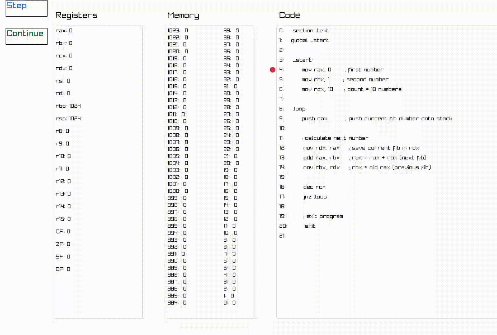

# Pynasm
A visual step-through debugger for NASM x86-64 programs

---

## Overview

**Pynasm** is a Python-based graphical tool that allows you to simulate the execution of NASM x86-64 assembly code. It helps you visualize register states and memory layout as you step through each instruction. 
I created this project for educational purposes, to better understand assembly. As such, it is not optimized and not 100% accurate in all cases. Use it as a learning aid, not a production-grade emulator.
---

## Features

- Step-by-step execution of NASM x86-64 code
- Live view of registers and memory layout

## Supported Instructions

The app currently supports a limited subset of NASM x86-64 instructions:

- `mov`, `movzx`, `movsx`
- `add`, `sub`, `xor`, `cmp`
- `inc`, `dec`
- `push`, `pop`
- `jmp`, `je`, `jne`, `jnz`, `jbe`, `jae`, `jge`
- `call`, `ret`

---

## Installation

1. Install dependencies from `requirements.txt`:
   ```
   pip install -r requirements.txt

2. Run the app with your NASM file:
   ```
   python app.py path_to_file.asm

---

## Example

Here's a simple NASM program that calculates the first 10 Fibonacci numbers and pushes them onto the stack.

```
section .text
global _start

_start:
    mov rax, 0      ; first number
    mov rbx, 1      ; second number
    mov rcx, 10     ; count = 10 numbers

.loop:
    push rax        ; push current fib number onto stack

    ; calculate next number
    mov rdx, rax    ; save current fib in rdx
    add rax, rbx    ; rax = rax + rbx (next fib)
    mov rbx, rdx    ; rbx = old rax (previous fib)

    dec rcx
    jnz .loop

    ; exit program
    exit
```

